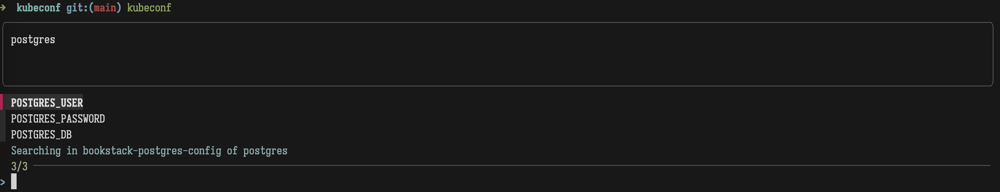

# Kubeconf

Kubeconf is a simple wrapper over fzf and kubectl to view configmaps effectively.

## Table of Contents

* [Installation](#installation)
* [Quickstart](#quickstart)
* [Usage](#usage)
* [Screenshots](#screenshots)


## Installation

* On macos
```bash
brew install handofgod94/tap/kubeconf
```

* Verify installation
```bash
kubeconf --version
```

## Quickstart

```bash
kubeconf # to launch the search window with default config
```

```bash

kubeconf -n <namespace> # to search of configmaps in a specific namespace
```

That's it. It opens up search window with list of configmaps in your current context and current namespace. 
You can search and view the configmap in a search window.

## Usage
```
usage: kubeconf [-h] [-n NAMESPACE] [-s SIZE] [-pp {up,down,left,right}]
                [-ps PREVIEW_SIZE] [-v]

Interactively lookup in kubernetes configmap

optional arguments:
  -h, --help            show this help message and exit
  -n NAMESPACE, --namespace NAMESPACE
                        Namespace to search in. Default is current namespace
  -s SIZE, --size SIZE  Size of the fzf window. Default: 30%
  -pp {up,down,left,right}, --preview-position {up,down,left,right}
                        Preview window position. Default: up
  -ps PREVIEW_SIZE, --preview-size PREVIEW_SIZE
                        Preview window size (in terminal lines). Default: 3
  -v, --version         show program's version number and exit

```

## Screenshots


